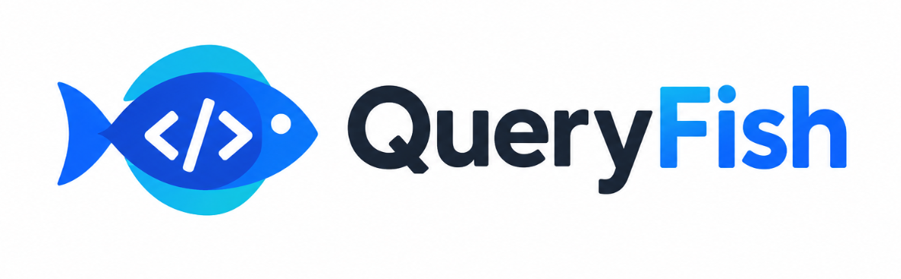

<div align="center">



**Hook your API. Typed, straight from the spec.**

Turn an OpenAPI document into fully typed [React Query](https://tanstack.com/query)
hooks powered by [react-query-kit](https://github.com/HuolalaTech/react-query-kit) —
with zero runtime and no hand-written client code.

[](./LICENSE)
[](https://nodejs.org)
[](https://www.typescriptlang.org/)

[Quick start](#-quick-start) · [How it works](#-how-it-works) · [Configuration](#%EF%B8%8F-configuration) · [Example app](./examples/petstore-react) · [Docs](./docs)

</div>

---

## Why QueryFish?

You already describe your API once, in OpenAPI. Writing the fetch functions, the
TypeScript types, and the React Query hooks by hand means describing it three
more times — and keeping all four in sync forever.

QueryFish generates the other three.

```diff
- const { data } = useQuery({
-   queryKey: ['pet', petId],
-   queryFn: () => fetch(`/api/pets/${petId}`).then(r => r.json()),
- });
- // data: any — and the key is whatever you remembered to type

+ const { data } = useGetPet({ variables: { petId } });
+ // data: Pet — petId is required, typos don't compile
```

**What makes it different:**

- 🎯 **It never guesses.** Where OpenAPI has no standard — pagination, notably —
  QueryFish requires an explicit opt-in instead of inferring. A wrong guess that
  compiles is worse than no feature.
- 🔑 **Query keys mirror your URLs**, so one call invalidates a whole resource
  tree instead of a single endpoint.
- 🪶 **Zero runtime.** QueryFish is a `devDependency`. Nothing it publishes ends
  up in your bundle.
- ✅ **The output is verified to compile**, not assumed to — CI type-checks
  generated code against the real react-query-kit on every run.
- 🧬 **Handles specs that break other generators**: recursive schemas, duplicate
  and missing `operationId`s, reserved words, `allOf`/`oneOf`, Swagger 2.0.

---

## 🚀 Quick start

**1. Install**

```bash
npm install queryfish --save-dev
```

**2. Write your client** — this is yours, so auth and interceptors stay in your
code:

```ts
// src/api/client.ts
import axios from 'axios'

export const client = axios.create({ baseURL: '/api' })
```

<sub>An axios instance works as-is. Prefer `fetch`? See the
[worked example](./examples/petstore-react/src/client.ts) — about 40 lines, no
dependencies.</sub>

**3. Configure**

```ts
// queryfish.config.ts
import { defineConfig } from 'queryfish'

export default defineConfig({
    input: './openapi.yaml', // path or URL
    output: './src/api',
    client: './src/api/client.ts',
})
```

**4. Generate**

```bash
npx queryfish generate
```

```
  + types.ts
  + requests.ts
  + queries.ts
  + mutations.ts
  + index.ts
✓ Generated 6 operations → src/api
```

**5. Use it**

```tsx
import { useGetPet } from './api/queries'
import { useCreatePet } from './api/mutations'

function Pet({ petId }: { petId: string }) {
    const { data, isPending } = useGetPet({ variables: { petId } })

    if (isPending) return <Spinner />
    return <h1>{data.name}</h1> // data is `Pet`, fully typed
}
```

---

## 🔍 How it works

Give it a spec:

```yaml
paths:
    /pets/{petId}:
        get:
            operationId: getPet
            summary: Get a pet by ID
            parameters:
                - name: petId
                  in: path
                  required: true
                  schema: { type: string }
            responses:
                '200':
                    content:
                        application/json:
                            schema: { $ref: '#/components/schemas/Pet' }
```

Get back four files of ordinary, readable TypeScript:

<table>
<tr><td width="50%">

**`types.ts`**

```ts
export interface Pet {
    id: string
    name: string
    tag?: string
}

export type GetPetVariables = {
    petId: string
}

export type GetPetResponse = Pet
```

</td><td width="50%">

**`requests.ts`**

```ts
import { client } from '../client'

export const getPet = (variables: GetPetVariables) =>
    client.request<GetPetResponse>({
        method: 'GET',
        url: `/pets/${variables.petId}`,
    })
```

</td></tr>
<tr><td>

**`queries.ts`**

```ts
/** Get a pet by ID */
export const useGetPet = createQuery<GetPetResponse, GetPetVariables>({
    queryKey: ['pets', '{petId}'],
    fetcher: getPet,
})
```

</td><td>

**`mutations.ts`**

```ts
/** Create a pet */
export const useCreatePet = createMutation<CreatePetResponse, CreatePetVariables>({
    mutationFn: createPet,
})
```

</td></tr>
</table>

Your spec's `summary` becomes JSDoc, so the description shows up on hover in
your editor.

### Query keys mirror your URLs

This is the detail that pays off daily. react-query-kit appends `variables`
automatically, so `['pets', '{petId}']` becomes
`['pets', '{petId}', { petId: '123' }]` at runtime — cache entries stay separate
per pet. But because the _prefix_ is the URL path, one call clears everything
about a resource:

```ts
// After creating, updating, or deleting a pet:
queryClient.invalidateQueries({ queryKey: ['pets'] })
// ↑ refetches /pets, /pets/{petId}, /pets/{petId}/toys — all of it
```

With operation-name keys you would have to list every affected hook by hand, and
update that list whenever an endpoint is added.

### Infinite queries — opt in, never inferred

OpenAPI has no standard for pagination. Generators that guess produce the worst
kind of bug: a hook that type-checks, looks right, and then silently fetches the
same page forever.

So QueryFish asks. Either in config:

```ts
pagination: {
  '/pets': { param: 'cursor', nextField: 'nextCursor' },
}
```

or in the spec itself:

```yaml
x-queryfish-pagination:
    param: cursor
    nextField: nextCursor
```

```ts
export const useListPetsInfinite = createInfiniteQuery<
    ListPetsResponse,
    Omit<ListPetsVariables, 'cursor'>, // ← cursor comes from pageParam
    Error,
    string | undefined
>({
    queryKey: ['pets'],
    fetcher: (variables, { pageParam }) => listPets({ ...variables, cursor: pageParam }),
    getNextPageParam: (lastPage) => lastPage?.nextCursor ?? undefined,
    initialPageParam: undefined,
})
```

Opt in to nothing and `infiniteQueries.ts` is never written at all.
<sub>[Full reasoning →](./docs/adr/0005-opt-in-pagination.md)</sub>

---

## ⚙️ Configuration

```ts
import { defineConfig } from 'queryfish'

export default defineConfig({
    /** Path or URL to your OpenAPI/Swagger document. Required. */
    input: './openapi.yaml',

    /** Directory for generated files. Required. */
    output: './src/api',

    /** Module exporting your HTTP `client`. Default: './client' */
    client: './src/api/client.ts',

    /** Opt in to infinite queries, keyed by path. Default: none. */
    pagination: {
        '/pets': { param: 'cursor', nextField: 'nextCursor' },
    },

    /** Format output with your Prettier config. Default: true */
    format: true,

    /** Emit a barrel index.ts. Default: true */
    barrel: true,
})
```

Config files may be `.ts`, `.mts`, `.js`, `.mjs`, or `.json`.

### CLI

```bash
queryfish generate [options]
```

| Option                | Description                             |
| --------------------- | --------------------------------------- |
| `-c, --config <path>` | Path to config file                     |
| `-i, --input <spec>`  | Path or URL to the OpenAPI document     |
| `-o, --output <dir>`  | Output directory                        |
| `--client <module>`   | Module exporting the HTTP client        |
| `--dry-run`           | Report what would change, write nothing |
| `--watch`             | Regenerate when the spec changes        |
| `--no-format`         | Skip Prettier formatting                |
| `--silent`            | Suppress output                         |

CLI flags override the config file. Errors point at the exact spot in your spec:

```
error: cannot resolve schema
  at paths./pets.get.responses.200
  in openapi.yaml:42

  Check that the $ref target exists in components.schemas.
```

---

## 📂 What gets generated

```
src/api/
├── types.ts           # Interfaces, enums, request/response types
├── requests.ts        # Plain async functions — usable without React
├── queries.ts         # createQuery factories (GET, HEAD)
├── mutations.ts       # createMutation factories (POST, PUT, PATCH, DELETE)
├── infiniteQueries.ts # createInfiniteQuery factories — only if opted in
└── index.ts           # Barrel re-export
```

Output is formatted with **your** Prettier config, so it matches the rest of
your codebase rather than fighting it. Commit it — it's meant to be read and
reviewed.

---

## 🧬 Specs it handles

Real specs break naive generators. These are covered, with a
[regression fixture](./test/fixtures/edge-cases.yaml) for each:

|                             |                                                                          |
| --------------------------- | ------------------------------------------------------------------------ |
| **Recursive schemas**       | `Comment.replies: Comment[]` and mutually recursive types emit correctly |
| **Missing `operationId`**   | Derived from method + path (`getPetsByPetIdToys`)                        |
| **Duplicate `operationId`** | Deterministically suffixed, with a warning                               |
| **Reserved words**          | `delete` → `delete_`                                                     |
| **Odd parameter names**     | `filter[status]`, `X-Request-Id` quoted correctly                        |
| **Composition**             | `allOf` → intersection, `oneOf`/`anyOf` → union                          |
| **Nullability**             | Both `nullable: true` and 3.1's `type: ['string', 'null']`               |
| **Empty responses**         | `204` → `void`                                                           |
| **Swagger 2.0**             | `definitions`, `in: body` parameters, response schemas                   |

---

## 📖 Documentation

|                                          |                                              |
| ---------------------------------------- | -------------------------------------------- |
| [Example app](./examples/petstore-react) | A React app using generated hooks end to end |
| [Architecture](./docs/architecture.md)   | How the generator works, stage by stage      |
| [Decisions (ADRs)](./docs/adr)           | Why things are the way they are              |
| [Contributing](./CONTRIBUTING.md)        | Clone to merged PR                           |
| [Conventions](./docs/conventions)        | Commits, code style, versioning              |

---

## 🗺️ Roadmap

- [x] `createQuery` and `createMutation` factories
- [x] `createInfiniteQuery` (opt-in)
- [x] Custom axios / fetch client support
- [x] Watch mode
- [x] OpenAPI 3.0, 3.1, and Swagger 2.0
- [ ] Zod schema generation for runtime validation
- [ ] MSW mock handler generation
- [ ] Suspense query variants
- [ ] Plugin system for custom output

Have a use case that doesn't fit? [Open an issue](https://github.com/ravitejas-tech/queryfish/issues) —
scope decisions are made in the open.

---

## 🤝 Contributing

Contributions are genuinely welcome, and the project is set up so a first PR
doesn't require asking anyone anything.

```bash
git clone https://github.com/ravitejas-tech/queryfish.git
cd queryfish
npm install
npm test
```

Start with [CONTRIBUTING.md](./CONTRIBUTING.md), then
[docs/architecture.md](./docs/architecture.md). If something looks wrong in the
code, check the [ADRs](./docs/adr) first — it may be deliberate, and the
reasoning plus the rejected alternatives are written down.

Good first contributions: add a spec shape to
[`edge-cases.yaml`](./test/fixtures/edge-cases.yaml) that breaks the generator,
or improve an error message.

---

## 📄 License

[MIT](./LICENSE)

<div align="center">
<sub>Built for teams who'd rather write features than fetch functions.</sub>
</div>
